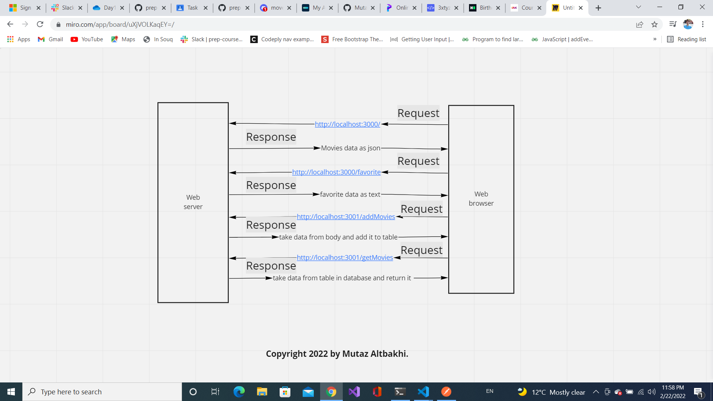

# Project Name - Project Version

**Author Name**: Mutaz Altbakhi

## WRRC
Add an image of your WRRC here

## Overview

## Getting Started
<!-- What are the steps that a user must take in order to build this app on their own machine and get it running? -->
1- Create server.js file

2- npm install express

4- app.listen(PORT, ()=>{ console.log("Anything") })

5- I can create end points (ex: app.get("/", homeHandler))

6- I will create the function for that end point(ex: homeHandler)
## Project Features
<!-- What are the features included in you app -->

2/21/2022
I continue building on the steps from the day before Additions

1- Instead of reading from the json file I send a request to a third party API

2- I read the documentation of the API and I tried on the Chrome or PostMan before I use it in our code.

3- I installed Axios to send an HTTP request to the API.

4- Axios is returning a promise so I should write my code that depend on the request result in the .then function.

5- Axios is returng a huge object so I just care about the data property.

6- I found the API key should not shown in my code so I created .env file and add the API Key there

7- I installed dotenv library the configure it to make our server read the .env file.

8- I created .env.example where I show the required variable for any developer will work on the same project.

9- I created error handler: - I create a function. - I make our server know about it by using app.use - When i want to use I will use it in the .catch function.

10- I created new end point that take the parameter from the URl where I found it inside req.query

2/22/2022
1- Install PostgreSQL

2- I run mt postgres server (sqlstart)

3- psql then create a database (CREATE DATABASE name-of-the-database)

4- I Created the database URL

5- Do the configurations for pg (require, new pg.Client, clint.connect)

6- End the take a post request

7- I put **app.use(express.json())** (top of the all end points)

8- build the function that insert in database

9- build a function that get data from my table in database

2/23/2022
1- I built an end point to get a specific record from the database

2- I built an end point to update a specific record in the database

3- I built an end point to delete a specific record from database based on the id